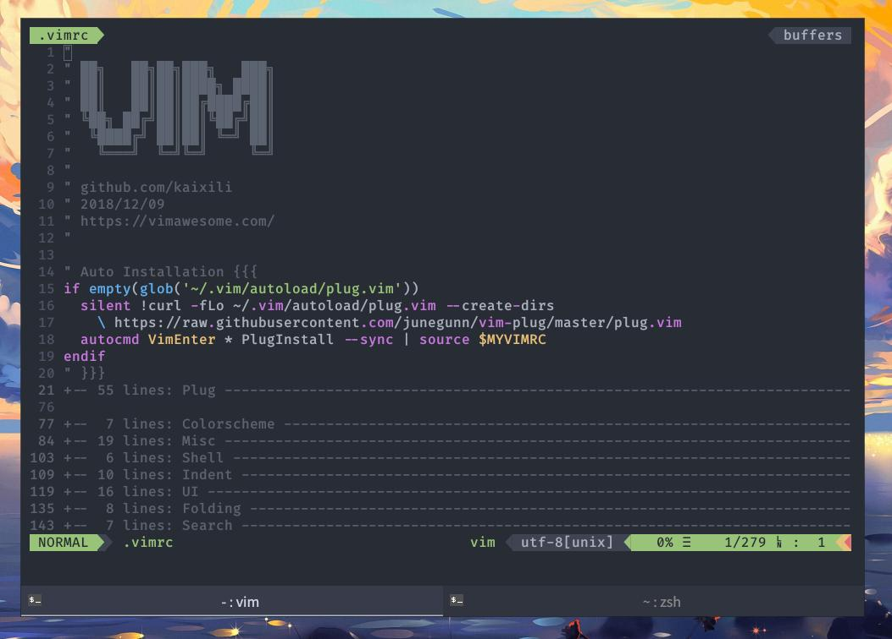
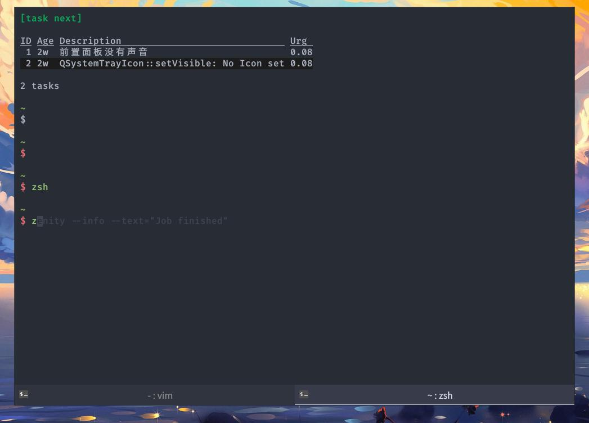

# Dotfiles
Simple and Stupid RC.
- vim
- zsh
- awesome wm
- Xresouce
- konsole tab css
- xinitrc && xprofile

# clone
```bash
cd ~
git clone https://github.com/kaixili/dotfiles ~/.dotfiles
cd ~/.dotfiles
git submodule init
cd ~

# link
ln -s .dotfiles/zsh/zshrc .zshrc
ln -s .dotfiles/vimrc .vimrc
```

# preview
- vim
    
- zsh
    


# font
- fira-code

# software
- tmux
- ydcv
- fzf
- rofi
