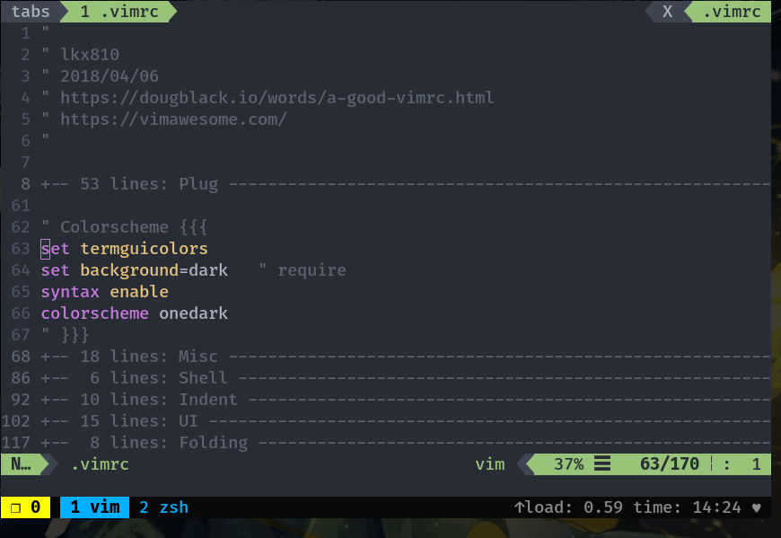
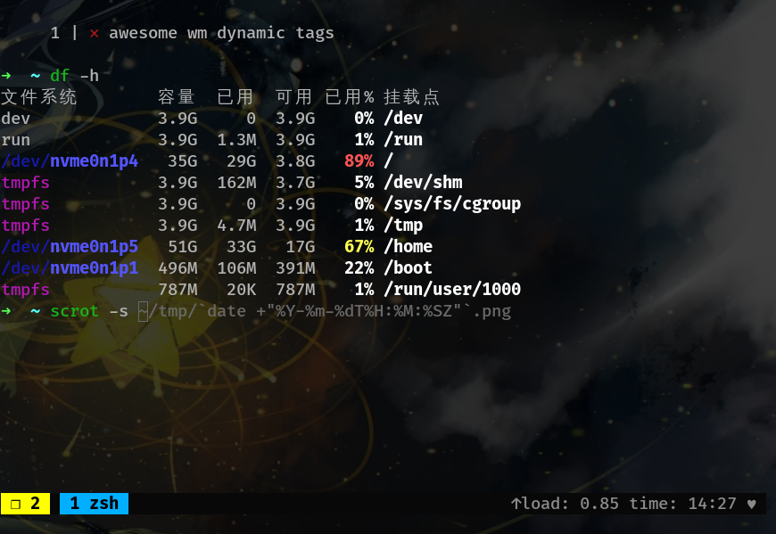

# Dotfiles

# clone
```bash
cd ~
git clone https://github.com/kaixili/dotfiles ~/.dotfiles
cd ~/.dotfiles
git submodule init
cd ~
ln -s .dotfiles/zsh/zshrc .zshrc
ln -s .dotfiles/vim/vimrc .vimrc
ln -s .dotfiles/tmux/tmux.conf .tmux.conf
ln -s .dotfiles/tmux/tmux.conf.local .tmux.conf.local
```

# screen


